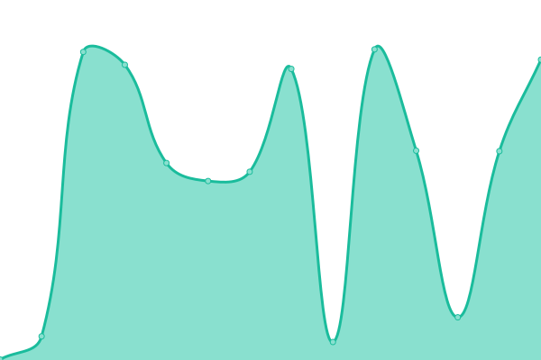
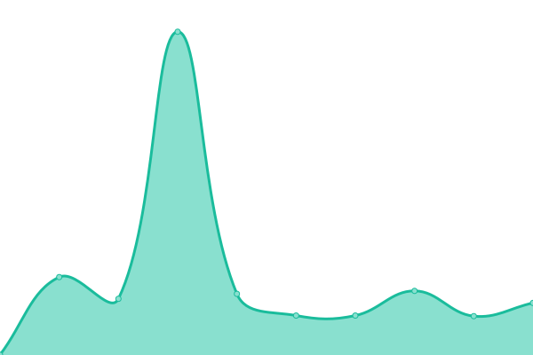
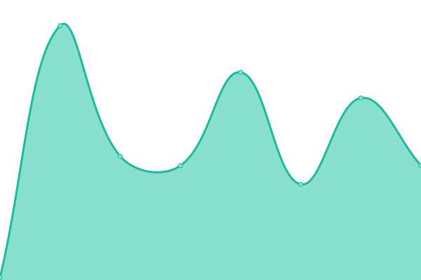
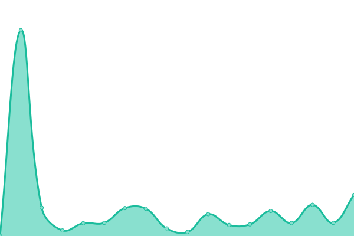

# [📈 Live Status](https://status.kukfest.eu): <!--live status--> **🟧 Partial outage**

This repository contains the open-source uptime monitor and status page for [Boof-Development](https://status.kukfest.eu), powered by [Upptime](https://github.com/upptime/upptime).

With [Upptime](https://upptime.js.org), you can get your own unlimited and free uptime monitor and status page, powered entirely by a GitHub repository. We use [Issues](https://github.com/Boof-Development/status/issues) as incident reports, [Actions](https://github.com/Boof-Development/status/actions) as uptime monitors, and [Pages](https://status.kukfest.eu) for the status page.

<!--start: status pages-->
<!-- This summary is generated by Upptime (https://github.com/upptime/upptime) -->
<!-- Do not edit this manually, your changes will be overwritten -->
<!-- prettier-ignore -->
| URL | Status | History | Response Time | Uptime |
| --- | ------ | ------- | ------------- | ------ |
|  [Kukfest](https://kukfest.eu) | 🟩 Up | [kukfest.yml](https://github.com/Boof-Development/status/commits/HEAD/history/kukfest.yml) | 

 190ms
     
 | 

<a href="https://status.kukfest.eu/history/kukfest">100.00%</a>
    

|  [Kukfest merch](https://merch.kukfest.eu) | 🟩 Up | [kukfest-merch.yml](https://github.com/Boof-Development/status/commits/HEAD/history/kukfest-merch.yml) | 

 141ms
     
 | 

<a href="https://status.kukfest.eu/history/kukfest-merch">100.00%</a>
    

|  [DB](https://db.080609.xyz/_/) | 🟩 Up | [db.yml](https://github.com/Boof-Development/status/commits/HEAD/history/db.yml) | 

 379ms
     
 | 

<a href="https://status.kukfest.eu/history/db">97.21%</a>
    

|  [CDN1](https://cdn1.boofdev.eu) | 🟩 Up | [cdn-1.yml](https://github.com/Boof-Development/status/commits/HEAD/history/cdn-1.yml) | 

 249ms
     
 | 

<a href="https://status.kukfest.eu/history/cdn-1">100.00%</a>
    

|  [CDN2](https://cdn2.boofdev.eu) | 🟥 Down | [cdn-2.yml](https://github.com/Boof-Development/status/commits/HEAD/history/cdn-2.yml) | 

 80ms
     
 | 

<a href="https://status.kukfest.eu/history/cdn-2">0.00%</a>
    

|  [CDN3](https://cdn3.boofdev.eu) | 🟩 Up | [cdn-3.yml](https://github.com/Boof-Development/status/commits/HEAD/history/cdn-3.yml) | 

 228ms
     
 | 

<a href="https://status.kukfest.eu/history/cdn-3">100.00%</a>
    

<!--end: status pages-->

[**Visit our status website →**](https://status.kukfest.eu)

## 📄 License

- Powered by: [Upptime](https://github.com/upptime/upptime)
- Code: [MIT](./LICENSE) © [Anand Chowdhary](https://anandchowdhary.com), supported by [Pabio](https://pabio.com)
- Data in the `./history` directory: [Open Database License](https://opendatacommons.org/licenses/odbl/1-0/)
